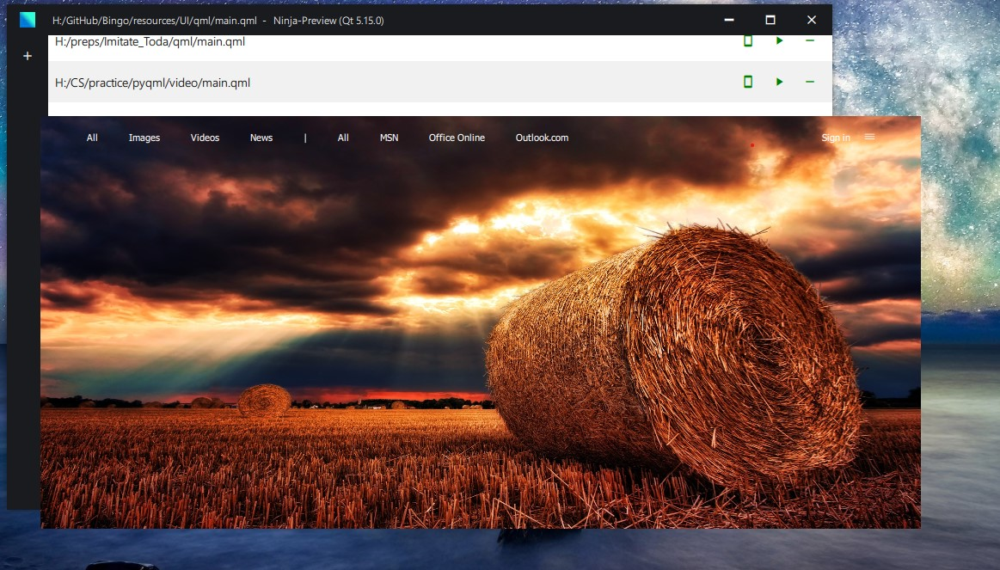

# Ninja-Preview
A preview your Qml files

Ninja-Preview or Ninja_Preview is a Graphical User Interface that aims at letting you use qmlview, which is just like qmlscene in a more flexible way, since 
both do not provide with Graphical User Interfaces.

# Screenshot

