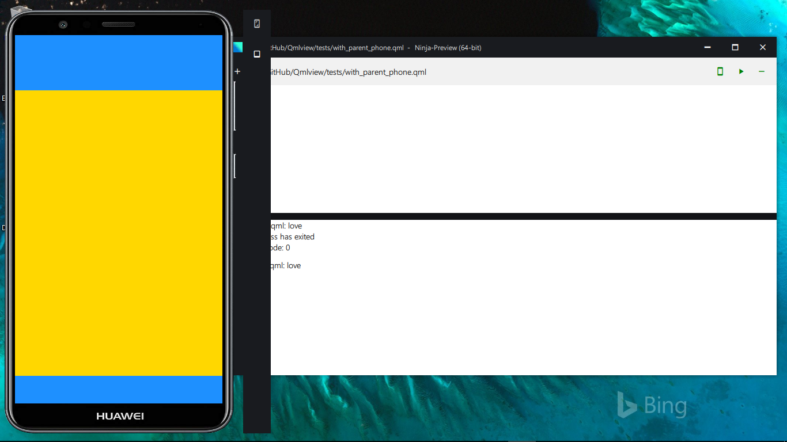

# Ninja-Preview

# Contributing
Please be sure to run the python inside the repository folder
 or use Ipython to run this app such as:
```C:\Users\path\to\python.exe -u - C:\path\to\Ninja-Preview\main.py```
This way the current working directory remains the repository folder,
which is necessary for the effecient running of the app, since all paths are
relative to the ```main.py```

# Screenshot

